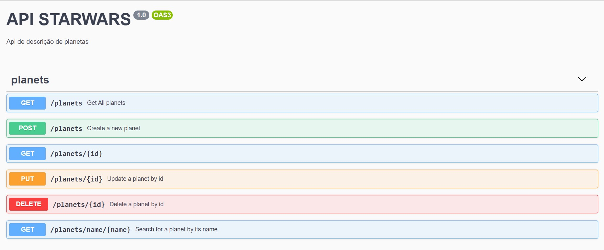

# Desafio B2W - API Star Wars


### Tecnologias
Esse projeto foi desenvolvido com:

* [Nodejs]
* [Nestjs]
* [Redis]
* [MongoDB]
* [Docker/Docker-Compose]

## Rodando o app com docker-compose
```bash
$ docker-compose up -d
```
## Rodando o app com docker-compose
#### Instalação

```bash
$ yarn install
```

### Configurações do .env
```bash
# porta da aplicação
port=3000

# SWAPI - The Star Wars API
SWAPI_HOST=https://swapi.dev/api

# configuração do banco mongodb
DATABASE_HOST=db
DATABASE_USER=root
DATABASE_PASSWORD=root
DATABASE_PORT=27017
```

### Rodando o app
```bash
# desenvolvimento
$ npm run start

# devenvolvimento com watch mode
$ npm run start:dev
```
### Rodando testes

```bash
# unidade
$ yarn run test

# e2e
$ yarn run test:e2e

# test coverage
$ yarn run test:cov
```

   [nodejs]: <http://nodejs.org>
   [Nestjs]: <https://nestjs.com/>
   [MongoDB]: <https://www.mongodb.com/>
   [Redis]: <https://redis.io/>
   [Docker]: <https://www.docker.com/>
   [Docker/Docker-Compose]: <https://www.docker.com/>

# Endpoints
 Acesse o swagger em http://localhost:3000/api e brinque com os endpoints
 

